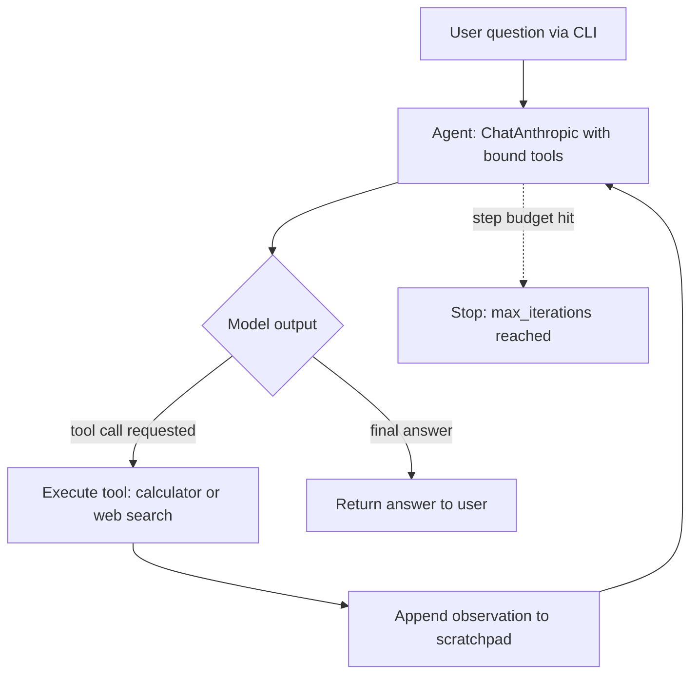

# feat: Module 2 — LangChain (chain, tools, tool-calling agent)

## Summary

Build Module 2 of DocuMind: refactor the Module 1 call into an LCEL chain (prompt template → model → output parser), add two LangChain tools (a local calculator and keyless web search), and an `AgentExecutor` tool-calling agent that decides when and which tool to call — closing the "no actions" gap. Ships as new modules alongside the untouched `documind.llm`, with offline tests, a CLI + `--demo`, a `docs/module-02.md` write-up, and a `v2-langchain` tag.

---

## Problem Frame

Module 1 left a learner who has felt the bare LLM's three gaps. Module 2 closes the "no actions" gap the way the ecosystem usually does — with LangChain — and the win condition is **fluency**: after this module the reader can write idiomatic LangChain (prompt templates, LCEL, output parsers, tools, the agent loop), not just run a working agent. Per origin, the agent uses LangChain's standard `create_tool_calling_agent` + `AgentExecutor` (the idiom), not LangGraph's prebuilt agent (held for Module 3).

---

## Key Technical Decisions

- **Agent = `create_tool_calling_agent` + `AgentExecutor`.** The idiomatic LangChain agent, confirmed with the user. `AgentExecutor(verbose=True)` gives the reason-act trace for free behind the CLI's verbose flag, and `max_iterations` enforces the bounded step budget (origin R8).
- **Provider = `ChatAnthropic` (langchain-anthropic); Claude required for the agent.** Tool-calling needs a tool-capable model; the optional local OpenAI-compatible backend from Module 1 can't do it (documented limitation, not supported). The chain uses `ChatAnthropic` too for consistency.
- **Shared chat-model factory with dependency injection.** One small helper builds the `ChatAnthropic` model from `documind.config` settings and is overridable with an injected model, mirroring Module 1's `make_client(client=...)` test seam. Chain, agent, and tests all build the model one way.
- **Deterministic tests via an injected fake chat model.** Unit tests inject a fake LangChain chat model scripted to emit tool calls (and fake tools for the agent), so the whole suite runs with no network and no `ANTHROPIC_API_KEY` (origin R11, AE5). The live network path (real Claude + real search) is exercised only by `--demo` and an optional, separately marked integration test.
- **Keyless web search via langchain-community DuckDuckGo.** No API key. Wrapped as a LangChain tool; treated as best-effort and faked in unit tests because it is non-deterministic and network-bound.
- **Safe calculator.** Arithmetic evaluated through a constrained evaluator (AST-based, no raw `eval`), so it is deterministic and unit-testable and rejects non-arithmetic input.
- **Packaging via a `[langchain]` optional extra.** Mirrors Module 1's `[local]` extra (`pip install -e ".[langchain]"`). Module 1's runtime deps stay unchanged.
- **Separate modules and entry points.** `documind.chain` and `documind.agent` each get a `python -m` CLI, mirroring `documind.llm`; `documind.llm` is untouched.

---

## High-Level Technical Design

The agent loop is the core mechanism (origin F1, R6–R8). `AgentExecutor` runs it; the diagram shows the shape it drives, bounded by `max_iterations`.

---

## Implementation Units

### U1. Packaging, config, and shared chat-model factory

**Goal:** Establish Module 2 scaffolding — the LangChain optional extra, an agent step-budget setting, and a dependency-injectable chat-model factory the chain and agent share.

**Requirements:** Supports R1, R2, R6 (foundation); R8 (step budget setting).

**Dependencies:** none.

**Files:**
- `pyproject.toml` (add `[langchain]` optional-dependencies extra)
- `src/documind/config.py` (add an agent max-steps setting)
- `src/documind/lc.py` (new — `chat_model(...)` factory)
- `tests/test_lc.py` (new)

**Approach:** Add a `[langchain]` extra (`langchain`, `langchain-anthropic`, `langchain-community`, plus the keyless-search backing package). Add a `DOCUMIND_AGENT_MAX_STEPS` setting to `Settings` with a sane default. `chat_model(model=None)` returns a `ChatAnthropic` built from settings (model name, max tokens), or returns an injected model unchanged — the same DI seam as `LLMClient(client=...)`.

**Patterns to follow:** `src/documind/config.py` `Settings` dataclass + env reads; `src/documind/llm.py` `make_client()` / injected-client pattern.

**Test scenarios:**
- Happy path: `chat_model()` returns a model configured with the settings' dev model and max-tokens.
- DI seam: `chat_model(model=fake)` returns the injected fake unchanged.
- Config: `DOCUMIND_AGENT_MAX_STEPS` is read from the environment and falls back to the default when unset.

**Verification:** `[langchain]` extra installs cleanly; factory builds a model without a network call or key; injected model passes through.

---

### U2. LCEL chain module + CLI

**Goal:** A minimal LCEL chain (prompt template → model → output parser) exposing a one-shot `ask`, with a `python -m documind.chain` CLI.

**Requirements:** R1, R2.

**Dependencies:** U1.

**Files:**
- `src/documind/chain.py` (new)
- `tests/test_chain.py` (new)

**Approach:** Compose `ChatPromptTemplate` (with an optional system message) `|` the model from `chat_model()` `|` `StrOutputParser()` using LCEL. Expose a small function/class that takes a question and returns text, with optional `system` and `model` overrides sourced from config like Module 1. CLI prints the answer for a question argument.

**Patterns to follow:** `src/documind/llm.py` `ask()` convenience + `main()` CLI shape; config-driven `system`/`model`.

**Test scenarios:**
- Happy path (R1): with an injected fake model returning a canned message, the chain returns the parsed string answer for a question.
- R2: a provided `system` prompt is included in the rendered prompt, and a `model` override is honored.
- Edge: a question with surrounding whitespace still produces an answer (no crash).

**Verification:** `python -m documind.chain "..."` prints an answer on the live path; unit tests pass offline with the fake model.

---

### U3. Calculator and web-search tools

**Goal:** Two LangChain tools — a safe local calculator and a keyless web search — discoverable and callable by the model.

**Requirements:** R3, R4, R5.

**Dependencies:** U1.

**Files:**
- `src/documind/tools.py` (new)
- `tests/test_tools.py` (new)

**Approach:** Define the calculator as a LangChain tool over an AST-based safe arithmetic evaluator (no raw `eval`). Wrap keyless DuckDuckGo search (langchain-community) as the second tool. Both carry clear names/descriptions/arg schemas so the model can route to them. Expose a list of the tools for the agent to bind.

**Patterns to follow:** Module 1's pure-function testability (`build_request`) for the calculator evaluator.

**Test scenarios:**
- Happy path (R3, AE1): calculator evaluates `4891*73` to exactly `357043`.
- Error path (R3): malformed expression and division-by-zero return a clean error string, not an exception.
- Security (R3): non-arithmetic input (e.g., attribute access / dunder names) is rejected rather than executed.
- R5: each tool exposes a non-empty `name` and `description` and an args schema.
- R4 (offline): the web-search tool, given a faked/stubbed backend, wraps results into a text string. Covers R4 without network.
- Integration (optional, network-marked): the real DuckDuckGo tool returns non-empty text for a simple query. Excluded from the default offline run.

**Verification:** calculator is exact and safe under unit tests; search tool returns text via the faked backend offline and via the real backend in the marked integration test.

---

### U4. Tool-calling agent + CLI + demo

**Goal:** An `AgentExecutor` agent that binds the tools to the model and runs the reason→act→observe loop until a final answer, with a CLI (`--verbose`, `--demo`).

**Requirements:** R6, R7, R8, R9, R10.

**Dependencies:** U1, U2, U3.

**Files:**
- `src/documind/agent.py` (new)
- `tests/test_agent.py` (new)

**Approach:** Build the agent with `create_tool_calling_agent(model, tools, prompt)` wrapped in `AgentExecutor(tools=..., max_iterations=settings.agent_max_steps)`. The model comes from `chat_model()` (injectable for tests); tools come from U3. CLI: `python -m documind.agent "question"`, `--verbose` maps to `AgentExecutor(verbose=True)` to surface the reason-act trace (origin open question resolved), `--demo` mirrors Module 1 by first showing the bare model guessing/failing on an act-requiring question, then the agent answering correctly via a tool.

**Technical design (directional, not specification):** tests inject a fake chat model scripted to return an assistant message with a `tool_calls` entry, then (after the tool observation) a final answer — letting the loop run deterministically offline.

**Patterns to follow:** `src/documind/llm.py` `main()` CLI + `--demo`; injected-fake test pattern.

**Test scenarios:**
- Happy path (R6, R7, AE1): a fake model scripted to call the calculator then answer makes the agent run the calculator and return the computed result.
- Direct answer (R7, AE3): a fake model that returns a final answer with no tool call makes the agent answer directly, invoking no tool.
- Multi-tool (R8, AE4): a fake model scripted to call web search then the calculator makes the agent execute both, in order, within the step budget, then answer.
- Edge (R8): a fake model that always requests a tool causes the agent to stop at `max_iterations` without looping forever.
- Offline suite (R11, AE5): all agent tests run with no network and no `ANTHROPIC_API_KEY`.
- Demo (R10): `--demo` is verified manually on the live path (network + Claude); excluded from the offline unit suite.

**Verification:** `python -m documind.agent "what is 4891 * 73?"` returns the exact product via the calculator; `--demo` shows the gap closing; offline tests pass with fakes.

---

### U5. Module write-up and roadmap update

**Goal:** Capture what was non-obvious and mark the milestone.

**Requirements:** R12.

**Dependencies:** U4.

**Files:**
- `docs/module-02.md` (new)
- `docs/ROADMAP.md` (update Module 2 status)

**Approach:** Write `docs/module-02.md` mirroring `docs/module-01.md` (what we built, the mental model, design choices, exercises, next). Update the Module 2 entry in `docs/ROADMAP.md` to done. The annotated `v2-langchain` tag is a release step performed after merge (noted in verification, not a code change).

**Patterns to follow:** `docs/module-01.md` structure and tone.

**Test scenarios:** Test expectation: none — documentation only.

**Verification:** write-up reads cleanly and matches the shipped code; roadmap reflects Module 2 complete.

---

## Scope Boundaries

Carried from origin — deferred to later modules:
- Memory / state across turns — Module 3 (LangGraph).
- Document retrieval (RAG) — Module 4.
- Structured-output validation and citation guardrails — Module 6.
- Multi-agent orchestration — Module 8.

Outside Module 2 (origin non-goals):
- Keyed search providers (e.g., Tavily) — keyless is the chosen default.
- LangGraph's prebuilt agent — held back so Module 3's state-graph rebuild is the contrast.
- Tool-calling on the local OpenAI-compatible backend — not supported by small local models.

---

## Risks & Dependencies

- **LangChain API churn.** Idioms shift across versions; verify the current `create_tool_calling_agent` / `AgentExecutor`, community search, and fake-chat-model APIs against installed versions at implementation (origin assumption). Pin versions in the `[langchain]` extra.
- **Anthropic credits required** for the agent path and the live `--demo`; the local backend can't tool-call.
- **Keyless DuckDuckGo can rate-limit or be flaky.** Mitigated by faking it in unit tests and treating live search as best-effort in the demo.

---

## Open Questions (deferred to implementation)

- Exact langchain-community import for keyless search (`DuckDuckGoSearchRun` vs `DuckDuckGoSearchResults`) and the backing package name (`ddgs` vs `duckduckgo-search`) — confirm against installed versions.
- Which fake chat-model class cleanly emits `tool_calls` in the installed `langchain-core` (e.g., `GenericFakeChatModel` vs a custom fake list model).
- Safe-calculator implementation detail (hand-rolled AST evaluator vs a small vetted dependency).
- Version pins for the `[langchain]` extra.

---

## Sources & Research

- `docs/brainstorms/2026-06-22-module-2-langchain-requirements.md` — origin requirements (R1–R12, F1, AE1–AE5, key decisions).
- `docs/ROADMAP.md` — Module 2 definition and conventions (annotated tag, per-module write-up).
- `docs/module-01.md` — conventions to mirror (pure functions, DI tests, CLI + `--demo`).
- `src/documind/llm.py`, `src/documind/config.py` — Module 1 client, `make_client()` DI seam, and env config to build on.
