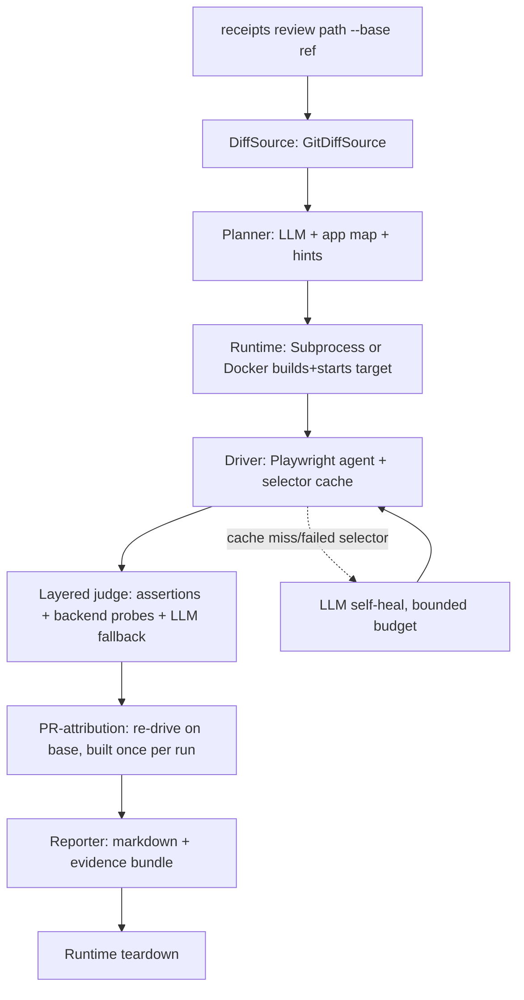

# feat: Receipts — runtime PR-verification agent (v1)

## Summary

Build Receipts v1: a standalone CLI tool that verifies a code change by **running the app**. Given a local git checkout and a base ref, it derives the change set, has an LLM plan the affected user flows, builds and runs the target from source, drives those flows in a real browser (Playwright) against the real backend with a self-healing selector cache, asserts UI and backend effects with a layered judge, attributes failures via base-branch replay, and emits a markdown report plus an evidence bundle. Ships as a top-level `receipts/` package (its own architecture, no `documind` reuse), with a bundled full-stack sample app carrying planted runtime bugs, offline unit tests using a fake LLM and stub target, a live `--demo`, and a write-up. `DockerRuntime` is built and unit-tested; the live end-to-end demo runs via `SubprocessRuntime` because the sandbox has no Docker daemon.

---

## Problem Frame

Static reviewers read the diff; the bugs that reach production only appear when the app runs. Receipts makes runtime behavior observable and hands back reproducible evidence. Per origin, v1 is the narrow vertical slice that proves that one claim end-to-end on one target, with every non-core concern (GitHub front-end, Docker live-run, dashboard, swarm) deferred behind a named seam. The plan is organized so the seven seams — `DiffSource`, `TargetConfig`, `Runtime`, `Planner`, `Driver`, `Reporter`, re-verify — land as independently testable units, deterministic parts first, the agentic browser path last and demo-verified.

---

## Key Technical Decisions

- **Package layout: standalone `receipts/` with a `src/`-style subpackage.** New top-level `receipts/` dir with its own `pyproject.toml` (or a `[project.optional-dependencies]` extra if kept single-project — decided in U1), Pydantic models in `receipts/models.py`, a Typer app in `receipts/cli.py`, and one module per seam. No import of `documind`.

- **Structured contracts up front (Pydantic v2).** `Change`, `TargetConfig`, `Scenario`, `TestPlan`, `StepAction` (the cache entry), `ScenarioResult`, `Finding`, `Report` are defined in U1 so every seam is written against typed contracts and can be faked. This is the DI seam that makes the offline suite possible.

- **`Runtime` is an abstract base with two impls.** `SubprocessRuntime` (default in the sandbox) and `DockerRuntime` share `build() / start() / base_url / healthcheck() / teardown()`. A context-manager guarantees teardown on any failure (origin R7). Selection via `receipts.yaml` / `--runtime`.

- **LLM access is one thin injectable client.** A small `receipts/llm.py` wraps the `anthropic` SDK with model routing (Opus for planning, Sonnet for per-step driving/judging) and is injected everywhere, so tests pass a `FakeLLM` scripted per scenario. No LangChain.

- **Driver caches resolved actions; the cache is the replay artifact.** `StepAction` records `intent → locator + input`. The driver tries the cache first (deterministic, no LLM), self-heals via the LLM on miss/failure up to a bounded per-step budget (default 3), and persists the cache as the scenario's replay artifact (origin R12, R15). Replay = run from cache with the LLM disabled. Each scenario also runs under an overall step budget and ends on an LLM "done" signal or budget exhaustion (reported stuck/inconclusive), a distinct verdict from an assertion failure (origin R11a).

- **Auth is scripted browser login; secrets via env only.** The driver logs in through the browser using steps from `receipts.yaml`, with optional session/cookie/token injection; credential fields resolve from environment variables and literals are rejected by config validation (origin R4).

- **Attribution re-drives on base, never replays the head cache.** The head selector cache is not replayed on the base branch (the changed UI may be absent there); attribution is an independent agentic drive on base with a fresh cache, and the base is built/started **once per run** and shared across all failing scenarios (origin R16).

- **Layered verdict.** Assertions and backend probes run first and are authoritative; the LLM-judge is invoked only when no machine check covers the expectation (origin R14). Keeps evidence trustworthy.

- **Deterministic tests, live demo.** Unit tests use `FakeLLM` + a fixed stub target (a tiny in-repo app served by `SubprocessRuntime`, or a recorded page) so they run offline with no key/Docker (origin R21, AE6). The real Claude + real browser path is a marked `live`/`integration` test and the `--demo` (origin R22).

- **Sample app kept lean but genuinely full-stack.** FastAPI backend + a small frontend (React/Vite vs. minimal vanilla decided in U10), an auth flow, a SQLite store, and 2–3 planted bugs matching the origin's failure classes, plus its own `receipts.yaml`.

---

## High-Level Technical Design

---

## Implementation Units

### U1. Scaffolding, packaging, models, LLM client, CLI skeleton

**Goal:** Establish the `receipts/` package, typed contracts, the injectable LLM client, and a Typer CLI skeleton everything else hangs off.

**Requirements:** foundation for all; directly R23 (structure).

**Dependencies:** none.

**Files:**
- `receipts/pyproject.toml` (or root extra — decide here), `receipts/__init__.py`
- `receipts/models.py` (Pydantic contracts)
- `receipts/llm.py` (anthropic wrapper + model routing + `FakeLLM`)
- `receipts/cli.py` (Typer app: `review`, `--base`, `--desc`, `--hint`, `--runtime`, `--demo` stubs)
- `receipts/tests/test_models.py`, `receipts/tests/test_llm.py`

**Approach:** Define all Pydantic models. Implement `LLM` with `plan()`/`act()`/`judge()` helpers routing to Opus/Sonnet, plus `FakeLLM` returning scripted responses. Wire a Typer app whose `review` command parses args and (for now) prints the resolved config — later units fill the pipeline.

**Patterns to follow:** DocuMind's `make_client(client=...)` DI seam (`src/documind/llm.py`), env-based config (`src/documind/config.py`).

**Test scenarios:** models round-trip validate; `FakeLLM` returns scripted output; CLI parses flags without a network call or key.

**Verification:** `receipts --help` and `receipts review ./x --base main` run and echo parsed inputs; offline tests pass.

---

### U2. DiffSource — GitDiffSource + interface

**Goal:** Produce a `Change` (files + unified patch + description) from a local checkout.

**Requirements:** R1, R2.

**Dependencies:** U1.

**Files:** `receipts/diff.py`, `receipts/tests/test_diff.py`

**Approach:** `DiffSource` ABC with `get_change() -> Change`. `GitDiffSource(path, base, desc=None)` shells `git diff <base>...HEAD` and `git log` for the description (overridable by `--desc`). Parse changed files + hunks (changed line ranges feed R8/R17).

**Test scenarios:** a temp git repo with a known commit yields the expected changed files and line ranges; `--desc` overrides log-derived description; empty diff handled cleanly.

**Verification:** run against this repo's own history and inspect the `Change`.

---

### U3. TargetConfig — receipts.yaml schema + loader

**Goal:** Load and validate a target's `receipts.yaml` (build/run/health/base URL, auth/seed, backend probes).

**Requirements:** R3, R4, R5.

**Dependencies:** U1.

**Files:** `receipts/config.py`, `receipts/tests/test_config.py`, `receipts/tests/fixtures/receipts.yaml`

**Approach:** PyYAML → `TargetConfig` Pydantic model with fields for `build`, `run`, `health` (url + timeout), `base_url`/`port`, `runtime` (subprocess|docker), `auth` (scripted browser login steps and/or a session/cookie/token injection), `seed`, `probes` (named HTTP endpoints and/or read-only DB queries), and `hints`. Credential fields resolve from environment variables (e.g. `${RECEIPTS_TEST_PASSWORD}`); literal secrets are rejected by validation. Validate with actionable errors.

**Test scenarios:** valid config parses; missing required field yields a clear error; unknown probe type rejected; a literal (non-env) credential value is rejected; an env-var reference resolves.

**Verification:** the sample app's `receipts.yaml` (U10) loads clean.

---

### U4. Runtime — interface + SubprocessRuntime + DockerRuntime

**Goal:** Build/run/health/teardown behind one interface, with both impls.

**Requirements:** R6, R7.

**Dependencies:** U1, U3.

**Files:** `receipts/runtime/__init__.py` (ABC), `receipts/runtime/subprocess.py`, `receipts/runtime/docker.py`, `receipts/tests/test_runtime.py`

**Approach:** `Runtime` ABC as a context manager: `build()`, `start()`, `wait_healthy()`, `base_url`, `teardown()`. `SubprocessRuntime` runs the config's build/run commands as host processes, polls the health URL, exposes the local base URL, and kills the process tree on exit. `DockerRuntime` builds an image (from a target `Dockerfile` or a generated one), runs a container publishing the port, polls health, and removes the container on exit. Teardown guaranteed via `__exit__`.

**Test scenarios:** SubprocessRuntime starts a trivial local server fixture and reaches healthy, then tears down (no orphan process); teardown runs even when `start()` raises; DockerRuntime image/build/run/remove commands unit-tested against a mocked docker client (daemon unavailable in sandbox).

**Verification:** SubprocessRuntime brings up the sample app live; DockerRuntime verified against mocks here and noted for live validation where a daemon exists.

---

### U5. Planner — LLM test-plan generation + app map + hints

**Goal:** Turn a `Change` + app map + hints into a structured, focused, steerable `TestPlan`.

**Requirements:** R8, R9, R10.

**Dependencies:** U1, U2.

**Files:** `receipts/planner.py`, `receipts/appmap.py`, `receipts/tests/test_planner.py`

**Approach:** `appmap.py` produces a lightweight map of routes/pages/endpoints (static scan of the target; kept small). `planner.plan(change, appmap, hints)` prompts Opus to emit a `TestPlan` of `Scenario`s (name, rationale, flow, expected outcome, adversarial flag, motivating lines), constrained to changed flows plus adversarial variants; hints add/prioritize/suppress. Parse into Pydantic; validate.

**Test scenarios:** with `FakeLLM` returning a canned plan JSON, the planner yields typed `Scenario`s tied to changed lines; a hint injects/suppresses a scenario; malformed LLM output is re-prompted or errors cleanly.

**Verification:** on the sample app's planted-bug diff, the live planner proposes scenarios that target the changed flows.

---

### U6. Driver — Playwright agent loop + self-healing selector cache

**Goal:** Drive a scenario in a real browser, agentically, with a deterministic-on-replay selector cache.

**Requirements:** R11, R11a, R12, R15.

**Dependencies:** U1, U4, U5.

**Files:** `receipts/driver.py`, `receipts/cache.py`, `receipts/tests/test_driver.py`, `receipts/tests/test_cache.py`

**Approach:** For each step, if a `StepAction` cache entry exists, execute it directly (no LLM); on miss or failure, capture page state (accessible DOM snapshot + screenshot), ask Sonnet for the next concrete action, execute via Playwright, and record/update the cache. Bounded per-step self-heal budget (default 3), then fail the step with evidence. The scenario runs under an overall step budget; it ends when the LLM signals completion or the budget is hit — the latter reported as stuck/inconclusive, distinct from an assertion failure (R11a). Record video (ffmpeg present), per-step screenshots, and a structured action log. Auth/seed run from `TargetConfig` before the flow (scripted browser login by default). Persist the cache as the replay artifact; `replay(cache)` runs with the LLM disabled. Tier-(a) unit tests inject a fake browser page so the loop is exercised with no real Chromium; the real browser is tier (b).

**Test scenarios:** with a fake page and scripted `FakeLLM`, the loop drives a login+action flow and populates the cache (tier a); replay from the cache issues zero LLM calls and reproduces actions (AE4); a deliberately stale selector triggers self-heal within the per-step budget; exceeding the per-step budget fails the step with a recorded reason; reaching the overall step budget without a completion signal reports the scenario as stuck/inconclusive (AE9); a tier-(b) test drives the real sample app in a real browser with `FakeLLM`.

**Verification:** live drive of the sample app's flows produces video + action log; replay is LLM-free.

---

### U7. Layered verdict + backend probes + LLM-judge fallback

**Goal:** Decide pass/fail trustworthily.

**Requirements:** R13, R14.

**Dependencies:** U1, U3, U6.

**Files:** `receipts/verdict.py`, `receipts/probes.py`, `receipts/tests/test_verdict.py`, `receipts/tests/test_probes.py`

**Approach:** `probes.py` executes declared HTTP/DB probes and returns typed results. `verdict.judge(scenario, ui_state, probe_results)` applies DOM/text assertions and probe checks first (authoritative); only when neither expresses the expectation does it call the LLM-judge over the final screenshot/DOM. Returns a `ScenarioResult` (verdict, evidence, reason).

**Test scenarios:** the reorder-persistence probe (`GET /api/items`) contradicting the UI yields FAIL (AE1); a passing assertion path never calls the LLM; the LLM-judge fallback fires only with no machine check present.

**Verification:** on the sample app, the planted persistence bug is caught by the probe, not the LLM.

---

### U8. PR-attribution (base-branch replay) + re-verify

**Goal:** Label failures PR-attributable vs. pre-existing, and re-run only affected scenarios on a new commit.

**Requirements:** R16, R19.

**Dependencies:** U2, U4, U6, U7.

**Files:** `receipts/attribute.py`, `receipts/reverify.py`, `receipts/tests/test_attribute.py`, `receipts/tests/test_reverify.py`

**Approach:** Build and start the base ref via `Runtime` **once per run**, then for each failing scenario re-run it there as an independent agentic drive with a *fresh* selector cache — **not** a replay of the head cache, since the changed UI may be absent on base and stale selectors would mislabel a pre-existing bug. Compare verdicts → pre-existing vs. PR-attributable (R16, AE5). Re-verify diffs a new commit against a stored prior run and selects affected scenarios by changed **files** (a robust superset), not the planner's noisier per-line mapping, then re-drives them and reports resolution (R19, F4).

**Test scenarios:** fail-on-both ⇒ pre-existing; fail-only-on-change ⇒ attributable; the base is provisioned once and shared across multiple failing scenarios; attribution does not replay head selectors on base (a fresh cache is used); re-verify selects the right file-based subset from a stored run and reports a resolved failure.

**Verification:** demonstrated on the sample app by toggling a planted bug between base and head.

---

### U9. Reporter — markdown + evidence bundle

**Goal:** Emit the receipts.

**Requirements:** R17, R18.

**Dependencies:** U7, U8.

**Files:** `receipts/report.py`, `receipts/tests/test_report.py`

**Approach:** `Reporter` ABC; `MarkdownReporter` writes a report (per-scenario pass/fail/inconclusive, severity, offending lines, plain-English repro, links into the evidence bundle) to stdout + a run directory holding video/screenshots/action log/replay cache. The v1 severity rubric is minimal and documented — two dimensions, **blast radius × reversibility/data-safety**, mapped to low/medium/high — not a production model. Offending lines come from the planner's motivating-lines annotation and are treated as best-effort (a wrong line is cosmetic, not a correctness issue). GitHub-comment reporter is a seam only.

**Test scenarios:** a mixed pass/fail result set renders the expected markdown sections and severity ordering; evidence paths resolve.

**Verification:** the end-to-end sample-app run produces a readable report a developer could act on without rerunning anything.

---

### U10. Bundled sample app + planted bugs + receipts.yaml

**Goal:** A real target to build, run, drive, and demo against.

**Requirements:** R20.

**Dependencies:** U3 (config shape).

**Files:** `receipts/sample_app/` (FastAPI backend, small frontend, SQLite, seed, `receipts.yaml`, `Dockerfile`), `receipts/sample_app/README.md`

**Approach:** Minimal full-stack app with an auth flow and an items list. Plant 2–3 runtime bugs from the origin's failure classes — e.g. (a) drag-reorder updates local state but never calls the API (never persists), (b) token refresh runs after redirect ⇒ stale-session login loop, (c) a boundary/permission bug. Provide `receipts.yaml` (build/run/health/auth/seed/probes incl. `GET /api/items`). Frontend stack (React/Vite vs. vanilla) chosen to keep the build fast while preserving a genuine browser flow.

**Test scenarios:** app boots via SubprocessRuntime and serves the auth + items flows; probes return expected shapes; each planted bug is reliably reproducible.

**Verification:** manual boot + click-through confirms each planted bug exists before Receipts is pointed at it.

---

### U11. End-to-end wiring + `--demo`

**Goal:** Assemble the pipeline into `receipts review` and a narrated `--demo`.

**Requirements:** R22 (and exercises R1–R19 together).

**Dependencies:** U2–U10.

**Files:** `receipts/pipeline.py`, `receipts/cli.py` (fill in), `receipts/tests/test_pipeline.py`

**Approach:** `pipeline.run(...)` sequences F1 with guaranteed teardown. `--demo` points at the bundled sample app, runs the full flow via SubprocessRuntime, and narrates the caught planted bugs. A tier-(a) pure-unit test covers `pipeline.run` wiring with all seams faked; a tier-(b) integration test (real browser + sample app + `FakeLLM`, no key/Docker) runs the pipeline against a scripted plan.

**Test scenarios:** tier-(a) wiring test drives the pipeline with every seam faked and asserts stage ordering + guaranteed teardown on mid-pipeline failure; tier-(b) integration run with `FakeLLM` + sample app produces a report catching a planted bug (deterministic slice of AE7, matches AE8).

**Verification:** `receipts review ./receipts/sample_app --base main` (live) writes a report catching the planted bugs (AE7); `--demo` narrates them.

---

### U12. Docs — README + write-up

**Goal:** Explain the architecture, the seven seams, and what was non-obvious.

**Requirements:** R23.

**Dependencies:** U11.

**Files:** `receipts/README.md`, `docs/receipts.md`

**Approach:** README covers what Receipts is, quickstart against the sample app, `receipts.yaml` reference, and the seams with their deferred extensions. `docs/receipts.md` captures design choices (why no LangChain, the self-healing-cache-as-replay insight, the Docker/subprocess split forced by the sandbox).

**Test scenarios:** none — documentation only.

**Verification:** a reader can run the sample-app demo from the README alone.

---

## Scope Boundaries

Carried from origin — deferred (seams only): GitHub-PR front-end + PR-comment reporter; zero-config auto-detection; browser swarm/parallelism, multi-tenant, dashboard; remote/k8s runners; learned org preferences.

Outside v1: live end-to-end `DockerRuntime` run in this sandbox (no daemon; built + mock-tested here, live-run elsewhere); non-web targets; auth flows unscriptable from `receipts.yaml`; a production-grade severity model.

---

## Risks & Dependencies

- **No Docker daemon in the sandbox.** Mitigated by the pluggable `Runtime`: `SubprocessRuntime` runs the live demo; `DockerRuntime` is unit-tested against a mocked client and validated where a daemon exists.
- **Agentic driver non-determinism / cost.** Mitigated by the selector cache (deterministic replay, LLM only on miss/heal), a bounded self-heal budget, Sonnet for per-step decisions, and keeping the offline suite on `FakeLLM`.
- **Playwright/ffmpeg setup.** Chromium + ffmpeg are preinstalled; the Python `playwright` package must be installed and pinned (no `playwright install` needed — use the preinstalled browsers path).
- **Sample-app build weight.** Frontend stack chosen for a fast build; if React/Vite is too heavy for the demo loop, fall back to a minimal vanilla SPA that still exercises a real browser flow.
- **Anthropic credits** required for planner/driver/judge and the live demo.
- **Attribution roughly doubles provisioning.** Re-driving on base is a second build+run; capped by building/starting the base **once per run** and sharing it across all failing scenarios (U8). Per-scenario base rebuilds are explicitly out.
- **Planner line-attribution is noisy.** Re-verify selects affected scenarios by changed **files**, not the planner's per-line mapping, so a bad mapping never skips a scenario; the line mapping is used only for best-effort report annotation (U8, U9).
- **Authenticated flows are the hard part.** v1 commits to scripted browser login (secrets via env only); apps needing real third-party OAuth/MFA are out of scope for v1 (U3, U6).

---

## Open Questions (deferred to implementation)

- Single-project (root extra) vs. nested `receipts/pyproject.toml` packaging (U1).
- Selector-cache key scheme + confirm self-heal budget default of 3 (U6).
- App-map depth: how much repo structure the planner actually needs (U5).
- Backend DB-probe access: read-only connection string vs. in-container query exec (U3/U7).
- Severity rubric dimensions (U9).
- Sample-app frontend: React/Vite vs. vanilla SPA (U10).
- Playwright `pytest` integration for the marked live browser test (U6/U11).

---

## Sources & Research

- `docs/brainstorms/2026-07-10-receipts-requirements.md` — origin requirements (R1–R23, F1–F4, AE1–AE7, key decisions).
- Ito landing-page copy (task description) — the product mirrored.
- `docs/plans/2026-06-22-001-feat-module-2-langchain-plan.md`, `docs/module-01.md` — repo conventions (unit structure, DI fakes for offline tests, CLI + `--demo`, per-deliverable write-up).
- Environment probe — Docker daemon unreachable; Playwright Chromium + ffmpeg preinstalled; Node 22; Python 3.11 — drove the runtime and testing strategy.
