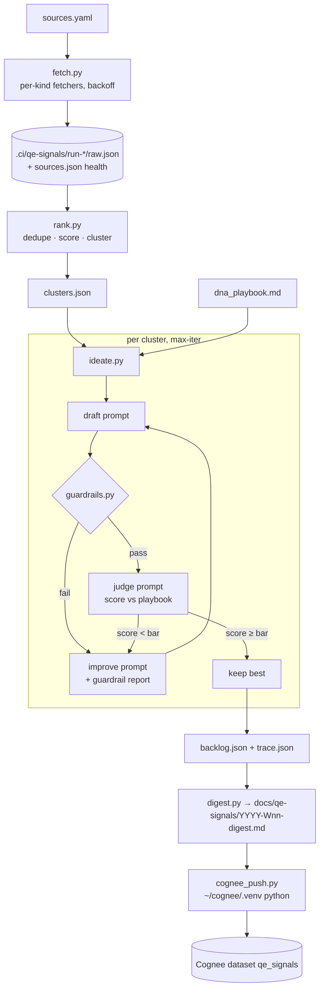
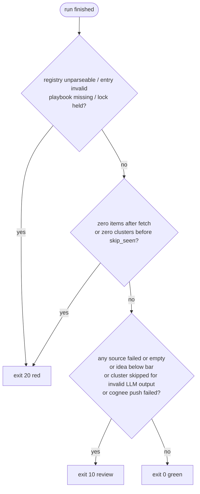

# feat: QE Signal Engine

## Summary

Add `qe_signals/`, a flat Python package that runs a four-stage pipeline: **fetch** the latest Quality-Engineering and AI-agent content from a user-editable source registry → **rank** and cluster it deterministically by quality-impact evidence and fit with the existing toolchain → **ideate** product ideas through a draft → guardrail → judge → improve loop scored against a user-owned DNA playbook → **deliver** a weekly markdown digest plus ranked idea backlog, committed under `docs/qe-signals/` and pushed into a Cognee dataset. The first real run is part of this plan's scope.

## Problem Frame

Vaibhav Sisinty's 4-step content framework (topic selection by agent swarms → packaging ranked on historical performance → loop-engineered scripting against a personal DNA playbook → agent-driven posting) automates content creation. The same shape applies to product discovery in QE: the sources are known and respected, the ranking signal is "does this move a real quality metric and does it fit what I already build", the DNA playbook is what has demonstrably worked in this repo (never-silent tools, requirement traceability, deterministic guardrails, small PRs, evidence over claims), and "posting" becomes delivering a reviewable digest into git and a recallable memory into Cognee. Today this research is manual and episodic; the goal is a weekly, unattended, auditable feed of ideas with evidence attached.

---

## Requirements

**Fetch**

- R1. Sources are declared in `qe_signals/sources.yaml`; adding a source is a data change, not a code change.
- R2. Every source kind in the registry (RSS/Atom, HN Algolia, GitHub search, arXiv, YouTube channel feed, sitemap+HTML) fetches without a paid key or a browser; only `http`/`https` URLs to public hosts are ever requested, on the first hop and on every redirect.
- R3. Each source's outcome (`ok`/`empty`/`failed`, item count, error text) is recorded and surfaced in the digest — a failed source is never silently dropped.
- R4. Only items published inside the window are kept — by default since the last successful run (fallback 7 days, capped at 30), overridable with `--since`; the digest states the actual window covered. an item with no parseable date is dropped and counted per source, never defaulted to now. Raw normalised items are written to a gitignored run directory.

**Rank**

- R5. Items are deduped by canonical-URL hash and by normalised title; a cluster is skipped when every one of its evidence ids was already ideated in the previous run, so an unchanged story is not re-ideated the following week.
- R6. Scoring is deterministic (source weight × recency decay × quality-impact vocabulary × toolchain-fit vocabulary) and reproducible from `raw.json` alone.
- R7. Items are clustered without an LLM; clusters carry the keyword that bound them.

**Ideate**

- R8. Each idea is generated from one cluster and must cite at least one real signal id; ideas that fail deterministic guardrails are redrafted, never published as-is.
- R9. Ideas are judged 0–100 against `qe_signals/dna_playbook.md`; the loop stops the moment the bar is met, otherwise continues to `--max-iter`, keeping the best iteration. Ideas that never clear the bar stay in the backlog labelled below-bar.
- R10. Every LLM call's prompt, raw response, parse status and score is written to the run trace.
- R11. Structured LLM output is prompt-steered JSON, tolerantly extracted and validated; invalid output is a reported signal, not a crash and not a silent fallback.

**Deliver**

- R12. The digest renders to `docs/qe-signals/<YYYY>-W<WW>-digest.md` with frontmatter (run id, window, model, playbook hash, source health) and sections: source health, top signals per cluster, ranked idea backlog with evidence links, failed sources.
- R13. Digest and each idea are pushed as separate documents into Cognee dataset `qe_signals`; push failure is an amber note, not a run failure.
- R14. Exit codes follow the repo vocabulary: 0 green, 10 review (any source failed or empty, any idea below bar, any cluster skipped for invalid LLM output, Cognee push failed), 20 red (registry unparseable or any entry invalid, playbook missing, zero items fetched, zero clusters after dedupe and clustering, a run already in progress). A week where `skip_seen` empties a non-empty cluster set is green with a "nothing new this week" note.

**Operability**

- R15. `--dry-run` runs fetch + rank with no LLM spend and prints the cluster table.
- R16. Tests are network-free; live fetches run only under `QE_SIGNALS_RUN_NETWORK_TESTS=1`.
- R17. The first real run produces a committed digest and a populated `qe_signals` Cognee dataset.
- R18. Total LLM calls per run are capped by `--max-calls` (default 60) independent of `--max-ideas` × `--max-iter`; `--dry-run` prints the projected call count.
- R19. A lock file in `.ci/qe-signals/` prevents overlapping runs; fetch has a per-source timeout and a total stage budget so a rate-limited source cannot stall the run.

---

## Key Technical Decisions

- **Flat package mirroring `pr_gate/`, not a `src/` package:** `pr_gate/` is the repo's established shape for deterministic QE tooling — module docstring as argparse description, `main(argv) -> int`, pure decision functions, JSON/YAML config beside the module, stderr for status, stdout for machine output. Following it keeps tests and CI conventions unchanged. One difference: `pr_gate` modules have no intra-package imports, while `qe_signals/run.py` imports its siblings, so the package is invoked as `python -m qe_signals.run` from the repo root (documind's `python -m documind.llm` pattern) — never as a bare `python qe_signals/run.py` path.
- **Direct Anthropic API, model configurable, default `claude-sonnet-5`:** the run must be unattended and weekly. The yilsf "session-as-provider" trick is free but needs Claude Code in the loop. Model is read from `QE_SIGNALS_MODEL` with the repo's env-override pattern; cost is bounded by `--max-ideas` × `--max-iter` × two calls.
- **Prompt-steered JSON → tolerant extraction → Pydantic validation; no JSON schema sent to the API:** matches `yilsf/src/structured.ts` and sidesteps the Anthropic `anyOf`/`discriminator` schema rejection seen when Cognee sent strict schemas. Validation result `{valid, errors, data}` is a hard signal in the trace.
- **Deterministic guardrails run before the LLM judge and their report is injected into the improve prompt:** the yilsf pattern — cheap regex checks (cites a signal id, names a metric, names a toolchain fit or "new", no hedging phrases, no URLs absent from the run) tell the model what to fix instead of asking it to re-judge.
- **DNA playbook is a markdown file the user owns:** `qe_signals/dna_playbook.md` is the analogue of a yilsf constitution — criteria with weights, injected verbatim into the judge prompt; its sha256 is stamped in the digest so a later reader knows which playbook scored the ideas.
- **New optional-dependency group `signals = [feedparser, pyyaml, pydantic, trafilatura]`; HTTP stays stdlib `urllib` + certifi:** the repo declares no HTTP client and prefers stdlib; certifi's CA bundle is already the fix for macOS TLS failures (`src/documind/tools.py`). feedparser avoids per-source XML code across RSS 2.0, Atom, GitHub-flavoured Atom and YouTube Atom. trafilatura is only for the four no-feed sources.
- **Retry/backoff in code, no `tenacity`:** two sources have hard limits (arXiv ≈1 req/3 s → 429; GitHub 10 req/min unauthenticated). A small per-kind `min_interval` in the registry plus exponential backoff on 429/5xx is simpler than a new dependency.
- **Raw run artefacts gitignored under `.ci/qe-signals/`, digest committed under `docs/qe-signals/`:** the repo's line — per-run JSON is regenerated and pruned (`pr_gate/run_history.py` naming: `run-<epoch_ms>-<sha8>`), durable prose is human-approved via PR. The digest is LLM-drafted; the merge is the approval. Everything under `docs/` is also auto-published to GitHub Pages by `qe-board-pages.yml`.
- **Cognee push via a subprocess into `~/cognee/.venv/bin/python`:** Cognee lives in a separate venv on Python 3.13; the repo venv is 3.14 and Cognee has no wheel path there. Dedicated dataset `qe_signals` — not `claude_code_memory` — so MCP `recall` can be scoped.
- **X/Twitter is out, not deferred:** X moved to pay-per-use in February 2026 with no free tier. LambdaTest has rebranded to TestMu AI; the registry uses the new feed URL and keywords.
- **Cross-week dedupe reads the previous run's `backlog.json`, not Cognee:** the newest run dir under `.ci/qe-signals/` is the cheapest source of "already ideated" signal ids; if none exists (first run, pruned, fresh clone) nothing is skipped and the digest says so. Committed state would be AI-authored state, which the repo forbids.
- **Cognee push is content-idempotent, not run-idempotent:** Cognee dedupes identical text by content hash, so re-pushing an unchanged digest is a no-op; a re-run for the same week after a registry fix produces new idea documents carrying the new run id. Acceptable for v1 and stated in the README.
- **Run-dir `sha8` is the sha256 prefix of `sources.yaml` + `dna_playbook.md`:** there is no code-under-test sha for a weekly job; the config hash makes provenance visible in the directory name.
- **`--since` defaults to the last successful run, not a fixed 7 days:** v1 is triggered by hand; a fixed window silently loses anything published between day 7 and the day the run is actually started. The previous run dir's timestamp is already read for `skip_seen`, so the window comes from the same place; 30-day cap keeps a long gap from flooding the run.
- **Weekly scheduling is a Makefile target in v1:** the only cron precedent in the repo is `semgrep.yml`; a `schedule:` workflow needs secrets and cache decisions that belong in a follow-up.

---

## High-Level Technical Design



Exit-code decision, evaluated once at the end of `run.py`:



Draft/judge JSON contract (directional, not implementation):

```text
Idea { title, problem, who_hurts, proposal, extends: klew|yilsf|pr_gate|testguard|documind|playbook-doctor|new,
       evidence: [signal_id...], quality_metric, smallest_slice }
Judgement { score: 0-100, per_criterion: {criterion: score}, fix_list: [str] }
```

---

## Output Structure

```text
qe_signals/
  __init__.py
  README.md
  sources.yaml            # registry (verified endpoints below)
  dna_playbook.md         # user-owned judging criteria
  models.py               # Signal, Cluster, Idea, Judgement (pydantic)
  fetch.py                # fetchers by kind + health record
  rank.py                 # dedupe, score, cluster (pure)
  llm.py                  # thin Anthropic adapter, injectable client, JSON extract+validate
  guardrails.py           # deterministic idea checks (pure)
  ideate.py               # draft → guardrails → judge → improve loop
  digest.py               # render markdown + frontmatter (pure)
  cognee_push.py          # runs under ~/cognee/.venv
  run.py                  # orchestrator CLI, exit codes, run dir, --keep  (invoke: python -m qe_signals.run)
tests/
  fixtures/qe_signals/    # sample feeds: rss.xml, atom.xml, hn.json, github.json, arxiv.xml, youtube.xml, page.html
  test_qe_signals_fetch.py
  test_qe_signals_rank.py
  test_qe_signals_llm.py
  test_qe_signals_guardrails.py
  test_qe_signals_ideate.py
  test_qe_signals_digest.py
  test_qe_signals_run.py
docs/qe-signals/
  2026-W38-digest.md      # first real run
.ci/qe-signals/           # gitignored run dirs
```

---

## Implementation Units

### U1. Package scaffold, registry, playbook, dependencies

**Goal:** Create the package skeleton, the verified source registry, the DNA playbook, and the tooling hooks so every later unit lands in a consistent frame.

**Requirements:** R1, R2, R16

**Dependencies:** none

**Files:**
- `qe_signals/__init__.py`, `qe_signals/README.md`
- `qe_signals/sources.yaml`
- `qe_signals/dna_playbook.md`
- `qe_signals/models.py`
- `pyproject.toml` (add `signals` extra; add `qe_signals` to ruff first-party)
- `.gitignore` (add `.ci/qe-signals/`)
- `Makefile` (add `signals` and `signals-dry` targets)
- `.github/workflows/ci.yml` (install `.[dev,langchain,signals]`)
- `tests/test_qe_signals_models.py`

**Approach:** `sources.yaml` entries: `name, kind, url|query, weight (0–1), tags, min_interval_s, timeout_s, enabled`. The whole registry is validated at startup; one invalid entry is red (exit 20) naming the entry, never a silently skipped source. Validation rejects any URL whose scheme is not `http`/`https` or whose host resolves to a loopback, link-local, or RFC 1918 address. Seed with the verified endpoints: Ministry of Testing RSS, TestMu AI blog RSS, Playwright and Cypress `releases.atom`, Cypress blog RSS, TestGuild RSS, Software Testing Weekly `/rss/`, Promptfoo blog RSS, four YouTube channel feeds (MoT, TestGuild, Automation Step by Step, Playwright), HN Algolia queries (`playwright`, `test automation`, `flaky tests`, `llm evaluation`, `ai agents testing`), GitHub topic searches (`playwright`, `test-automation`, `qa-automation`, `llm-testing`, `ai-agents`), arXiv `cs.SE` queries (`LLM testing`, `test generation`, `agent evaluation`), and sitemap+HTML for Selenium blog, confident-ai blog, LangChain blog, Anthropic engineering. `dna_playbook.md` lists weighted criteria (never-silent, traceability, deterministic guardrails, small shippable slice, evidence over claims, fits toolchain, measurable quality metric) with one-line "what good looks like" each. `models.py` defines `Signal`, `SourceHealth`, `Cluster`, `Idea`, `Judgement` as pydantic models with `model_validate` used everywhere downstream.

**Patterns to follow:** `pr_gate/pr-gate.config.json` + `pr_gate/incidents.example.json` (config beside package); `pyproject.toml` extras pattern (`local`, `langchain`).

**Test scenarios:**
- `sources.yaml` parses and every entry validates against the registry model; unknown `kind` raises a clear error naming the entry.
- `Idea.model_validate` rejects an idea with empty `evidence` and an `extends` value outside the enum.
- `dna_playbook.md` exists and its sha256 helper returns a stable value for identical content.

**Verification:** `pip install -e ".[signals]"` succeeds on CI's 3.11/3.12 matrix; `ruff check .` clean; `make signals-dry` prints usage without importing anthropic.

---

### U2. Fetchers with health record and run directory

**Goal:** Fetch every source kind into normalised `Signal`s, recording per-source health, inside a freshness window, into a gitignored run directory.

**Requirements:** R2, R3, R4, R19

**Dependencies:** U1

**Files:**
- `qe_signals/fetch.py`
- `tests/fixtures/qe_signals/{rss.xml,atom.xml,hn.json,github.json,arxiv.xml,youtube.xml,page.html,sitemap.xml}`
- `tests/test_qe_signals_fetch.py`

**Approach:** One `fetch_<kind>(entry, since, http) -> list[Signal]` per kind; `http` is an injectable callable (`url, headers, timeout -> bytes`) so tests pass fixture bytes. Shared `_get()` uses `urllib` with certifi SSL context, a descriptive `User-Agent`, follows at most 5 redirects and re-checks scheme and resolved host on every hop (reject loopback, link-local, RFC 1918, and non-http(s)) before connecting, honours `min_interval_s` per kind (arXiv 3 s, GitHub 6 s), and retries 429/5xx with exponential backoff (max 3). HN uses `search_by_date` with `numericFilters=created_at_i>` computed from `since`; GitHub uses `created:>` and `sort=updated`; arXiv uses `sortBy=submittedDate`; sitemap kind filters `<loc>` by path prefix and `lastmod >= since`, then extracts text with trafilatura. Signal id = sha256 of the canonical URL (scheme+host+path, no query/fragment, trailing slash stripped). Dates are normalised to aware UTC from each kind's field (`published`/`updated`/`created_at`/`pushed_at`/`lastmod`); an item with no parseable date is dropped and counted in `health.undated`. HTML summaries are stripped to text and truncated (`max_chars`). Each source has `timeout_s` (default 20) and the stage has a total budget (default 10 min); a source that exceeds its budget is `failed: timeout`. `fetch_all` returns `(signals, health)` and writes `raw.json` + `sources.json` to `.ci/qe-signals/run-<epoch_ms>-<sha8>/`.

**Patterns to follow:** `src/documind/tools.py` `_http_get_json` (certifi context, timeout); `pr_gate/requirements_source.py` (graceful `None` + stderr status line); `pr_gate/run_history.py` (run-dir naming, `--keep` pruning, injectable `now_ms`).

**Test scenarios:**
- RSS fixture yields Signals with title, canonical url, published as aware UTC datetime, text summary without HTML tags.
- GitHub-flavoured Atom fixture (Playwright releases) keeps the changelog body as summary text.
- YouTube fixture reads `media:description` into summary.
- HN fixture: items older than `since` are excluded; `points` and `num_comments` are carried into `Signal.extra`.
- arXiv fixture: two entries, one outside window → one Signal; the query URL contains `sortBy=submittedDate`.
- Sitemap fixture with three `<loc>`: only the one whose path matches the prefix and `lastmod` is in-window is fetched; the page fixture yields non-empty extracted text.
- HTTP callable raising `URLError` → health `failed` with the error string, zero Signals, no exception propagates.
- HTTP returning 429 then 200 → one retry, health `ok`, and the recorded `attempts` is 2.
- A source returning a 200 with zero in-window items → health `empty`, not `failed`.
- An item with no date field → dropped, `health.undated` incremented, not defaulted to now.
- A source whose HTTP callable sleeps past `timeout_s` → health `failed: timeout`, remaining sources still fetched.
- Canonical id: `https://a.com/x/?utm=1#frag` and `https://a.com/x` produce the same id.
- A redirect to `http://169.254.169.254/` or `http://10.0.0.5/` → request refused, health `failed: blocked host`, no connection attempted (assert via the injected resolver).
- A redirect chain longer than 5 hops → health `failed: too many redirects`.
- Run dir is created with `raw.json` and `sources.json`; running with `--keep 2` after three runs leaves the two newest directories.

**Verification:** With `QE_SIGNALS_RUN_NETWORK_TESTS=1`, a live smoke test fetches three verified sources (MoT RSS, Playwright releases.atom, HN) and each returns `ok` with ≥1 item.

---

### U3. Deterministic rank: dedupe, score, cluster

**Goal:** Turn raw Signals into scored, deduplicated clusters with no LLM involvement.

**Requirements:** R5, R6, R7, R15

**Dependencies:** U1

**Files:**
- `qe_signals/rank.py`
- `qe_signals/vocab.yaml` (quality-impact and toolchain-fit term lists with weights)
- `tests/test_qe_signals_rank.py`

**Approach:** `dedupe(signals)` drops exact id duplicates, then near-duplicate titles (lowercased, punctuation-stripped, ≥0.9 token-set overlap), keeping the higher-weight source. `score(signal, now, vocab)` = `weight × recency(0.5 half-life at 3.5 days) × (1 + Σ quality hits) × (1 + Σ toolchain hits)`, with HN points and GitHub stars as a bounded log bonus. `cluster(signals)` groups by the highest-weight shared vocabulary term, then merges clusters whose titles share ≥2 significant tokens; each cluster records `key_term`, member ids, top score. `top_clusters(n)` orders by summed score. `skip_seen(clusters, prior_backlog)` runs after clustering and after the zero-cluster check, drops clusters whose evidence ids are all in the previous run's ideated ids and records them as `skipped_seen`; the previous run is the newest dir under `.ci/qe-signals/`, absent on first run. `vocab.yaml` scoring is pinned by a golden-file test so edits change scores visibly. All functions pure; `now` injected.

**Patterns to follow:** `pr_gate/flakedoctor.py` (score/classify/advise triad), `pr_gate/reqdrift.py` (normalised hashing), `pr_gate/intent_coverage.py` (term-overlap grading).

**Test scenarios:**
- Two Signals with the same id → one survives.
- Titles "Playwright 1.63 released!" and "playwright 1.63 released" → one survives, the higher source weight.
- Same Signal scored at `now` and at `now + 7d` → second score is lower; at `now + 3.5d` it is ≈ half.
- A Signal mentioning "flaky" and "playwright locators" scores higher than an otherwise identical Signal with neither.
- Ten Signals with three distinct key terms → three clusters, each carrying its `key_term` and members.
- Two clusters whose titles share "self-healing locators" merge into one.
- Empty input → empty clusters, no exception.
- Score is identical across two calls with the same inputs (determinism guard).
- A cluster whose three evidence ids all appear in the prior `backlog.json` → skipped and listed in `skipped_seen`; a cluster with one new id → kept.
- No prior run dir → nothing skipped, `prior_run` is `None` in the output.
- Golden file: scoring the fixture set matches `tests/fixtures/qe_signals/scores.golden.json`; changing a vocab weight fails the test.

**Verification:** `make signals-dry` on a fixture run dir prints the cluster table to stdout as JSON and a human summary to stderr, without importing `anthropic`.

---

### U4. LLM adapter and structured-output contract

**Goal:** A thin, testable Anthropic adapter with prompt-steered JSON extraction and Pydantic validation.

**Requirements:** R10, R11

**Dependencies:** U1

**Files:**
- `qe_signals/llm.py`
- `tests/test_qe_signals_llm.py`

**Approach:** `LLM(client=None, model=None)` builds the Anthropic client lazily and accepts an injected SDK-shaped fake. `complete(system, user) -> str` joins text blocks; temperature 0; `max_tokens` from env. `structured(system, user, Model) -> Parsed{valid, errors, data, raw}` appends a strict "output ONLY JSON matching this shape" directive, strips fences/prose around the first balanced `{`/`[`, `json.loads`, then `Model.model_validate`. Every call appends `{stage, prompt_sha, model, raw, valid, errors, ms}` to a trace list the caller flushes to `trace.json`. No schema is sent to the API.

**Patterns to follow:** `src/documind/llm.py` (`LLMClient(client=...)`, pure `build_request`), `yilsf/src/structured.ts` (`extractJson` + `safeParse`), `tests/test_llm.py` (fake client shape).

**Test scenarios:**
- Fake client returning ```` ```json {...} ``` ```` → `valid=True`, data populated, fences stripped.
- Fake returning prose before and after the JSON object → still parses.
- Fake returning JSON missing a required field → `valid=False`, `errors` names the field, `data=None`, no exception.
- Fake returning non-JSON → `valid=False`, `raw` preserved in the trace.
- Two calls → trace has two entries with distinct `prompt_sha` and the `stage` label passed in.
- Constructing `LLM()` with no API key and never calling it does not raise (lazy client).

**Verification:** Unit tests pass with no `ANTHROPIC_API_KEY` in the environment.

---

### U5. Deterministic idea guardrails

**Goal:** Pure checks that reject malformed or unsupported ideas before any judge call.

**Requirements:** R8

**Dependencies:** U1

**Files:**
- `qe_signals/guardrails.py`
- `tests/test_qe_signals_guardrails.py`

**Approach:** `check(idea, known_signal_ids, known_urls) -> Report{passed, issues[{kind, message}]}`. Checks: every `evidence` id exists in the run; every URL in free text exists in the run's signals; `quality_metric` is non-empty and contains a measurable noun (rate, time, count, %, coverage, MTTR…); `extends` is one of klew, yilsf, pr_gate, testguard, documind, playbook-doctor, or `new`; no hedging phrases from a list (`might`, `could potentially`, `it is assumed`, `probably`); `smallest_slice` is present and under a word cap; title unique across the batch. The report text is what the improve prompt receives.

**Patterns to follow:** `yilsf/src/guardrails.ts` (pure, `{passed, issues}` shape, injected into the fix prompt).

**Test scenarios:**
- Idea citing an id not in the run → `passed=False`, issue kind `unknown_evidence`.
- Idea whose proposal contains a URL absent from the run → issue `invented_source`.
- `quality_metric = "better quality"` → issue `unmeasurable_metric`; `"flaky-test rate"` passes.
- `extends = "cypress"` → issue `unknown_toolchain`; `"new"` passes.
- Problem text containing "could potentially" → issue `hedging`.
- Two ideas with the same title in one batch → the second gets `duplicate_title`.
- Fully valid idea → `passed=True`, empty issues.

**Verification:** Guardrails module imports nothing from `llm.py` or `anthropic`.

---

### U6. Loop-engineered ideation

**Goal:** For each top cluster, draft an idea, run guardrails, judge against the playbook, improve until the bar is met or iterations run out, keep the best.

**Requirements:** R8, R9, R10, R18

**Dependencies:** U3, U4, U5

**Files:**
- `qe_signals/ideate.py`
- `qe_signals/prompts.py` (draft, judge, improve builders as functions)
- `tests/test_qe_signals_ideate.py`

**Approach:** `ideate_cluster(cluster, signals, playbook, llm, bar, max_iter) -> Result{best: Idea, best_score, iterations: [IterationRecord], met_bar}`. Iteration: draft (or improve with prior idea + guardrail report + judge fix_list) → `structured(..., Idea)`; if invalid, record and retry once with a "return valid JSON" nudge, then give up on the cluster with `met_bar=False`; guardrails; if failed, skip the judge and go straight to improve (saves a call); judge → `structured(..., Judgement)`; an invalid judge response scores 0 for that iteration, consumes the iteration, and is recorded; keep max by score; stop the moment `score ≥ bar`, else at `iter == max_iter`. A run-level `CallBudget(max_calls)` is decremented on every LLM call; when exhausted, remaining clusters are recorded as `skipped_budget` and the run continues to deliver. `ideate_all(clusters, ...)` caps at `--max-ideas` and returns results ordered by best score. The playbook text is injected verbatim into the judge system prompt; the judge prompt asks for per-criterion scores whose weighted mean must equal `score` — a deterministic recompute overrides the model's total if they disagree.

**Patterns to follow:** `yilsf/src/pipeline.ts` (generate → critique → guardrails → validate with a per-stage trace), `yilsf/src/constitutions.ts` (rule set injected as data).

**Test scenarios:**
- Scripted fake LLM: draft valid → guardrails pass → judge 80 with bar 75 → one iteration, `met_bar=True`, exactly two LLM calls.
- Draft fails guardrails (unknown evidence) → improve called with the guardrail report in the prompt, judge not called on the first iteration.
- Judge returns 60, 70, 90 across three iterations with bar 85 → three iterations, best 90, `met_bar=True`.
- Judge returns 60, 65, 70 with `max_iter=3`, bar 75 → best is 70, `met_bar=False`, result still returned.
- Draft returns invalid JSON twice → cluster result has `best=None`, trace shows both attempts, other clusters still processed.
- Judge per-criterion weighted mean is 72 but `score` says 90 → recorded score is 72.
- `--max-ideas 2` with five clusters → two results, the two highest-scoring clusters chosen.
- Judge returns invalid JSON on iteration 1, 80 on iteration 2 → iteration 1 recorded with score 0 and `valid=False`, best is 80.
- `max_calls=3` with two clusters → first cluster completes (2 calls), second is `skipped_budget` after its draft, digest still renders.

**Verification:** A recorded-trace run on fixtures shows every LLM call with stage, validity and score; total calls ≤ `max_ideas × max_iter × 2`.

---

### U7. Digest rendering

**Goal:** Render the run into a committed markdown digest with frontmatter and a JSON backlog sidecar.

**Requirements:** R12, R14

**Dependencies:** U2, U3, U6

**Files:**
- `qe_signals/digest.py`
- `tests/test_qe_signals_digest.py`

**Approach:** `build_model(health, clusters, results, meta) -> dict` (pure) then `render_markdown(model) -> str`. Frontmatter: `run_id, generated, since, model, playbook_sha, sources_ok, sources_failed, ideas, ideas_met_bar`. Sections in order: Window line (actual `since` used and why — last run, fallback, cap, or explicit); Source health table (name, status, items, note); Top signals per cluster (key term, 3 highest with title → link, source, score); Idea backlog ranked by score (title, score, iterations, extends, quality metric, smallest slice, evidence as signal titles linked to URLs); Failed sources with error text; Skipped clusters (`skipped_seen`, `skipped_budget`, invalid-output) with counts; a footer line "Generated by `qe_signals/run.py`; ideas are LLM-drafted — the merge is the approval." Every link is emitted as a markdown link only when its scheme is `http` or `https`; any other scheme renders as plain text. Filename from ISO week of the run date. `backlog.json` sidecar holds the full `Result` list.

**Patterns to follow:** `pr_gate/test_plan.py` (`build_plan` pure + `render_markdown` + `--out`/`--json` sidecar), `docs/requirements/PB-parabank-test-plan.md` footer convention.

**Test scenarios:**
- Model with two ok sources and one failed → health table has three rows, failed section lists the error.
- Ideas render in descending score; an idea with `met_bar=False` is marked "below bar" in the backlog.
- Evidence ids resolve to their signal titles and URLs; an id with no matching signal renders as the raw id (never dropped).
- Frontmatter values round-trip through a YAML parse and `playbook_sha` equals the sha256 of the playbook fixture.
- Rendered digest contains no absolute path under the user's home, no `ANTHROPIC`/`LLM_API_KEY` string, and no `<script`/`<iframe` from fetched HTML.
- A signal whose URL is `javascript:alert(1)` renders its title as plain text with the URL escaped, never as a markdown link.
- Run dated 2026-09-14 → filename `2026-W38-digest.md`.
- Empty clusters with all-failed sources → digest still renders with an explicit "no signals this week" line.
- Two clusters `skipped_seen` and one `skipped_budget` → the Skipped section lists each with its reason; nothing is silently absent.

**Verification:** Rendered fixture digest passes a markdown lint (no raw HTML, tables well-formed) and opens correctly on GitHub Pages after merge.

---

### U8. Cognee push

**Goal:** Store the digest and each idea as separate documents in Cognee dataset `qe_signals` via the existing Cognee venv.

**Requirements:** R13

**Dependencies:** U7

**Files:**
- `qe_signals/cognee_push.py`
- `tests/test_qe_signals_cognee_push.py`

**Approach:** Script intended to run under `~/cognee/.venv/bin/python` (path configurable via `QE_SIGNALS_COGNEE_PYTHON`). Loads `~/cognee/.env` and the repo `.env`, mirrors `ANTHROPIC_API_KEY` to `LLM_API_KEY`, then `cognee.add([digest_text, *idea_texts], dataset_name="qe_signals")` and `cognify`. Each idea text is prefixed with `## Idea <run_id>/<n> — <title>` so recall returns identifiable units. `run.py` invokes it as a subprocess with a timeout and treats non-zero exit as an amber note. The push script itself exits non-zero on any failure with the error on stderr.

**Patterns to follow:** `~/cognee/store_sessions.py` (block splitting, dataset naming, env loading order).

**Test scenarios:**
- Argument parsing: missing digest path → exit 2 with usage on stderr.
- `build_documents(digest_text, backlog)` yields one digest doc plus one doc per idea, each idea doc starting with the `## Idea` header.
- `run.py` with `--no-cognee` never spawns the subprocess (assert via injected runner).
- Injected runner returning exit 1 → run result carries an amber note `cognee push failed: ...` and the exit code is 10, not 20.
- Injected runner timing out → same amber path, note mentions the timeout.
- Pushing the same digest text twice → second `add` reports zero new documents (content-hash dedupe), asserted through an injected fake `cognee` module.

**Verification:** After the first real run, `mcp__cognee__recall` with `datasets="qe_signals"` for "top idea this week" returns the highest-scoring idea's title.

---

### U9. Orchestrator CLI and exit codes

**Goal:** One command that runs the pipeline end to end with the repo's traffic-light exit codes and flags.

**Requirements:** R14, R15, R16, R18, R19

**Dependencies:** U2, U3, U6, U7, U8

**Files:**
- `qe_signals/run.py`
- `Makefile`
- `tests/test_qe_signals_run.py`

**Approach:** Flags: `--since` (default: since the last successful run dir, else `7d`, capped at `30d`), `--dry-run`, `--no-cognee`, `--max-ideas 8`, `--bar 75`, `--max-iter 3`, `--max-calls 60`, `--model`, `--keep 12`, `--out docs/qe-signals`, `--json`. Fail-closed preamble: registry unparseable or playbook missing → exit 20 before any fetch. After fetch: zero items → exit 20. `decide(health, results, cognee_ok) -> (code, reasons, notes)` is pure. Human summary on stderr with the traffic light; `--json` puts `{code, reasons, notes, digest_path, run_dir}` on stdout. `--dry-run` stops after rank, prints the cluster table and the projected LLM call count (`min(max_calls, clusters × max_iter × 2)`). A lock file `.ci/qe-signals/.lock` holding the pid is created at start and removed at exit; a live pid in the lock → exit 20 `run in progress`; a stale pid is replaced with a note. Run dir name `run-<epoch_ms>-<sha8>` where `sha8` is the sha256 prefix of registry + playbook. Zero clusters after dedupe and clustering → exit 20; zero clusters remaining after `skip_seen` → exit 0 with note `nothing new this week`. Old run dirs pruned to `--keep`.

**Patterns to follow:** `pr_gate/gate.py` (`decide` pure, `read_report` fail-closed, `reasons`/`notes`, `· note:` lines), `tests/test_retest.py::test_cli_offline_dry_run` (in-process `main([...])`).

**Test scenarios:**
- `decide` with all sources ok, all ideas met bar, cognee ok → 0.
- One source failed → 10 with reason naming the source.
- One idea below bar → 10 with reason naming the idea.
- Cognee push failed → 10 with a note, not a reason.
- Zero signals fetched → 20 with reason `no signals fetched`.
- Missing playbook file → 20 before fetch is called (assert fetch not invoked).
- Registry YAML with a syntax error → 20, error line on stderr, no traceback.
- Registry entry with `kind: twitter` → 20 naming the entry, fetch not invoked.
- Lock file with a live pid → 20 `run in progress`; lock file with a dead pid → run proceeds with a `stale lock replaced` note.
- Fixture fetch yields items that all dedupe to zero clusters → 20 `no clusters after rank`.
- Fixture yields three clusters and the prior `backlog.json` covers all of them → exit 0, note `nothing new this week`, digest lists three `skipped_seen`.
- `--dry-run` output includes `projected_llm_calls` equal to `min(max_calls, clusters × max_iter × 2)`.
- `main(["--dry-run"])` with fixture fetchers → exit 0, cluster table on stdout, `anthropic` never imported.
- `--json` output parses and contains `digest_path`.
- No prior run dir → window is 7d; prior run 12 days ago → window is 12d; prior run 45 days ago → window is capped at 30d and a note says so; explicit `--since 3d` overrides all three.

**Verification:** `make signals-dry` and `make signals` both invoke `python -m qe_signals.run` from the repo root and run from a clean checkout with `pip install -e ".[signals]"`; tests import `from qe_signals import …` via the existing `pythonpath = ["."]`.

---

### U10. First real run and digest commit

**Goal:** Produce the first genuine weekly digest and Cognee dataset, and record what the run revealed.

**Requirements:** R3, R17

**Dependencies:** U9

**Files:**
- `docs/qe-signals/2026-W38-digest.md`
- `qe_signals/sources.yaml` (adjust weights/queries from what the run shows)
- `qe_signals/README.md` (document the run, cost, and known-flaky sources)

**Approach:** Run `make signals` with default flags against the live registry. Review the source-health table first; for any `failed` source, fix the registry entry or mark it `enabled: false` with a reason, then re-run. Review the idea backlog for evidence quality; tune `vocab.yaml` weights if the top clusters are noise. Then read every idea's score and per-criterion breakdown: scores must show real spread (not all within a few points of `--bar`) and at least one idea must read as playbook-aligned to you; if scores are flat or uncorrelated with your judgment, revise the judge prompt or `dna_playbook.md` and re-run before treating this unit as complete. Commit digest + registry tweaks in one PR. Note the Anthropic spend for the run in the README so weekly cost is known before automation.

**Test scenarios:** Test expectation: none — this unit is an operational run; correctness is covered by U2–U9.

**Verification:** Digest committed and visible on GitHub Pages; `sources_failed` in its frontmatter is 0 or every failure has a registry note; judge scores show spread and at least one idea passes a human playbook-alignment read; `recall` on dataset `qe_signals` returns the top idea; run cost recorded.

---

## Scope Boundaries

**Out of scope**
- Posting or publishing anything outside the repo (no LinkedIn, X, newsletter).
- A web UI; the GitHub Pages copy of `docs/` is the only view.
- Transcript-level analysis of YouTube videos or podcasts; titles and descriptions only.
- Building any of the generated ideas.

### Deferred to Follow-Up Work
- Weekly automation as a `schedule:` GitHub Actions workflow (needs `ANTHROPIC_API_KEY` secret, `.ci/qe-signals` cache, `continue-on-error` per source, `pipefail` on any `tee`).
- Historical-performance feedback ("packaging" in Sisinty's model): scoring ideas by which past ideas were actually built or upvoted; needs a feedback file and at least a few weeks of digests.
- LLM classification of items into a fixed taxonomy before clustering; v1 clusters lexically.
- Selenium blog, confident-ai, LangChain and Anthropic engineering via sitemap+HTML are included but are the most likely to rot; a `check-sources` subcommand that live-verifies every registry URL is a natural follow-up.
- Rolling multi-week seen-set and suppression of repeated *signals* in the digest itself; v1 only avoids re-ideating against the previous run.

---

## System-Wide Impact

- **CI:** `ci.yml` installs a new `signals` extra on the 3.11/3.12 matrix; `feedparser`, `pyyaml`, `pydantic`, `trafilatura` must resolve there. Tests guard optional imports with `importorskip` so a missing extra never reds the whole suite.
- **GitHub Pages:** `qe-board-pages.yml` copies all of `docs/` to the site, so every merged digest is public the moment it lands on `main`. Digests must not contain the API key, run-dir absolute paths, or raw fetched HTML.
- **Secrets:** `ANTHROPIC_API_KEY` is read from `.env` at run time only; the Cognee subprocess mirrors it to `LLM_API_KEY` in its own environment. No key is written to any run artefact or the digest.
- **Lint:** `qe_signals` is added to ruff's first-party set so import sorting matches `pr_gate`.
- **Untrusted input reaches the LLM:** fetched page text is embedded in draft prompts. The system prompt frames it as data; content is truncated; guardrails reject any URL or id not present in the run, so an injected instruction cannot smuggle a source into the backlog.
- **No existing module changes:** `pr_gate`, `yilsf`, `testguard` and `src/documind` are untouched; the only shared files are `pyproject.toml`, `Makefile`, `.gitignore`, `ci.yml`.

---

## Risks & Dependencies

| Risk | Impact | Mitigation |
|---|---|---|
| Feed URLs rot (LangChain's RSS already redirects to HTML) | Silent loss of a source | Health record per source; `empty`/`failed` shown in digest; exit 10 on any failure |
| arXiv 429s; GitHub 10 req/min | Partial fetch | Per-kind `min_interval_s`, backoff, one query per registry entry |
| LLM spend creeps | Weekly cost surprise | `--max-ideas × --max-iter × 2` cap; dry-run first; cost logged in README after U10 |
| Judge scores drift with model updates | Backlog not comparable week to week | Model and playbook sha stamped in frontmatter; deterministic recompute of weighted score |
| Ideas hallucinate sources | Misleading backlog | Guardrail rejects any URL or id not in the run |
| Cognee venv drift (Python 3.13 vs repo 3.14) | Push fails | Subprocess boundary; failure is amber, digest already on disk |
| CI installs new extras (`feedparser`, `trafilatura`) | CI red on push | Add `signals` to `ci.yml` install in U1; `importorskip` guards in tests |
| Anthropic strict-schema rejection | Structured output fails | No schema sent; prompt-steered JSON + Pydantic |
| Same clusters re-ideated weekly | Wasted spend, stale backlog | `skip_seen` against previous run's `backlog.json`; digest lists skipped clusters |
| Overlapping runs (manual now, scheduled later) | Colliding run dirs, double push | pid lock file; exit 20 while a run is live |
| Prompt injection from fetched pages | Idea cites a planted source or follows embedded instructions | Content truncated and framed as data; guardrails reject unknown URLs/ids; trace keeps raw output for audit |
| Public digest leaks something private | Pages publishes `docs/` | Digest renderer never emits env, absolute paths, or raw HTML; U7 test asserts none of these appear |

---

## Sources & Research

- Repo conventions: `pr_gate/gate.py` (fail-closed `read_report`, exit 0/10/20, `reasons`/`notes`), `pr_gate/run_history.py` (run-dir naming and pruning), `pr_gate/test_plan.py` (pure build + render + sidecar), `src/documind/llm.py` and `tests/test_llm.py` (injectable SDK-shaped fake), `src/documind/tools.py` (certifi SSL context for macOS).
- yilsf patterns to port: `yilsf/src/pipeline.ts`, `structured.ts`, `guardrails.ts`, `constitutions.ts`; honesty rules in `yilsf/eval/README.md` (mock runs are illustration, not evidence).
- Verified endpoints (fetched 2026-09-14): MoT `https://www.ministryoftesting.com/contents/rss`; TestMu AI `https://www.testmuai.com/blog/feed.xml`; Playwright `https://github.com/microsoft/playwright/releases.atom`; Cypress `https://github.com/cypress-io/cypress/releases.atom` and `https://www.cypress.io/blog/rss.xml`; TestGuild `https://testguild.com/feed/`; Software Testing Weekly `https://softwaretestingweekly.com/rss/`; Promptfoo `https://www.promptfoo.dev/blog/rss.xml`; YouTube channel feeds `https://www.youtube.com/feeds/videos.xml?channel_id=` for `UCG-ZnPKunTkEsY7xcaZcOQg` (MoT), `UC1IuOajCAtHvLyZgkIK47dQ` (TestGuild), `UCTt7pyY-o0eltq14glaG5dg` (Automation Step by Step), `UC46Zj8pDH5tDosqm1gd7WTg` (Playwright); HN `https://hn.algolia.com/api/v1/search_by_date` (https only); GitHub `https://api.github.com/search/repositories` (10 req/min unauth); arXiv `http://export.arxiv.org/api/query` (~1 req/3 s). No feed: Selenium blog, confident-ai blog, LangChain blog, Anthropic engineering — sitemap + HTML. X/Twitter: pay-per-use since Feb 2026, excluded.
- Cognee: `~/cognee/ingest.py`, `~/cognee/store_sessions.py`; dataset naming and env-loading order; URL fetcher ignores 308 redirects (push text, not URLs).
