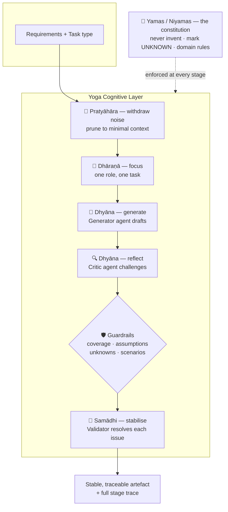
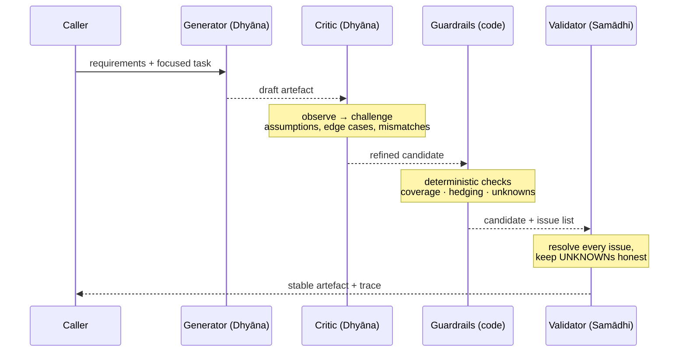

# YILSF — One-Page Visual Model

A single picture of the framework: the yogic path from distraction to stable
insight, mapped onto the pipeline. Rendered with Mermaid (GitHub renders it
inline).

---

## The cognitive stack

---

## The dialogue that creates stability

Three roles, one model, three disciplines. Stability is an emergent property of
the dialogue, not of any single call.

---

## The mapping, at a glance

| Principle | Sanskrit | Discipline | Control in YILSF |
|-----------|----------|------------|------------------|
| Withdraw noise | Pratyāhāra | Calm the inputs | Pruned, minimal context |
| Focus | Dhāraṇā | One-pointed attention | Single role + single task |
| Flow | Dhyāna | Sustained, self-aware reasoning | Generate → critique |
| Stability | Samādhi | Settled, unshakeable output | Guardrails → validate |
| Ethics | Yamas/Niyamas | Restraint & observance | Domain constitution |

> **The tagline:** *observe → reflect → refine → stabilise.*
